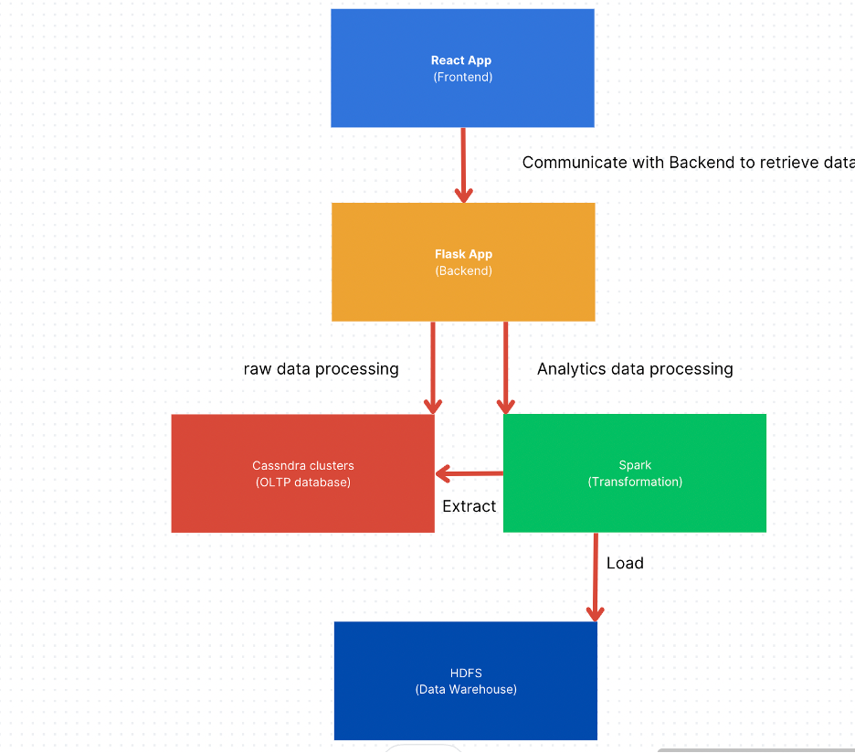

# HealthHive

HealthHive is a health information application designed to empower individuals to create personalized and easily accessible health insights. It provides customers with access to a comprehensive suite of health management resources to assist them in understanding and promoting their wellness. The application includes features such as health logs, health visualization, wellness forecasts, and health chat assistants.

## Documentation Update

- Rev. 1.0 <2023-05-20>
- Rev. 1.1 <2023-08-01>
- Rev. 1.2 <2023-09-02> Version 1.0 released and deployed

## Features

- **Health Logs**: Easily track and record your health data, including vital signs, symptoms, medication, and lifestyle factors.
- **Health Visualization**: Visualize your health data through interactive charts and graphs, allowing you to gain insights and identify trends.
- **Wellness Forecast**: Get personalized wellness forecasts based on your health data, helping you plan and make informed decisions.
- **Health Chat Assistants**: Interact with chat assistants powered by artificial intelligence to receive personalized health recommendations and guidance.

## Documentation

Please check the project documentation at [here](./~%24althHive_Requirement_Documentation.v1.3.docx)

## Project Structure




# Start

To run the app with all features, you need to build your docker container with two steps.

## Get Start (Frontend, Backend, DB)

At Directory **HealthHive**, build up docker containers use following command

```
docker-compose build 
```

Then run build up containers communication in background using following command

```
docker-compose up -d
```

**Notice** This step will take 1-2 min to come up because the Cassandra cluster has to initialize.

Feel free to check flask server's status using

```
docker logs healthhive-flask-backend-1
```
**Or**

```
docker logs <-container id of flask backend container->
```

## Get Start (Spark Cluster)

At Directory **spark-app**, build up docker containers use following command

```
docker-compose build 
```

Then run build up containers communication in background using following command

```
docker-compose up -d
```

**Notice:** Spark Cluster require tremendous resources to initialize. The default setting of docker container is using Spark locally. But feel free to try the Spark cluster setting by editing the comments from docker-compose file!


## Access 
- Access React app at **localhost:3000**
- Access Flask app at **localhost:4001**
- Access Spark app at **localhost:4002**
if decide to use Spark cluster feature, access the spark Web ui at **localhost:8080**

## Deployment Requirement

- Obtain a Google Credentials OAuth Client ID
- Obtain a Chatgpt api key

In react-app/src/configData.js, replace the **CLIENT_ID:** with Google client id and replace the **GPT_API_KEY** with Chatgpt api key. 


